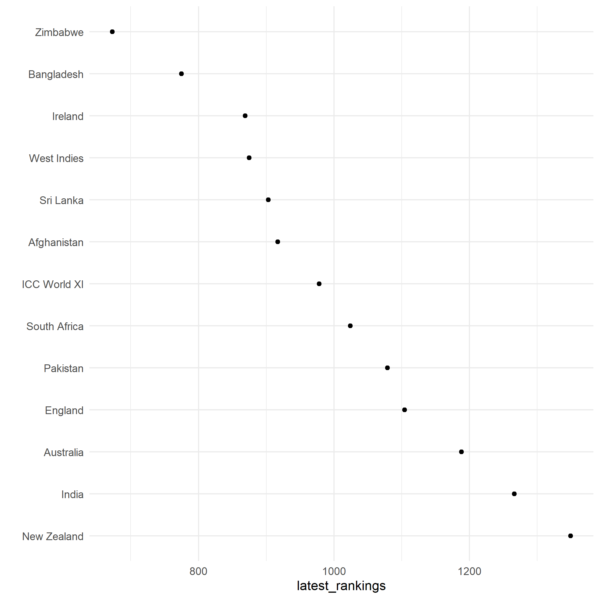

## Over Time ELO Rankings of International Cricket Teams By Format

The ICC only lists the [current ranking of cricket teams](https://www.icc-cricket.com/rankings/mens/team-rankings/odi). To address the paucity of historical ranking data, we generate ELO rankings.

### Data, Scripts, and Outputs

To build the [dataset of matches](data/), we used the [python wrapper to espncricinfo](https://github.com/outside-edge/python-espncricinfo).

* [ELO](scripts/elo.R)

**Test Rankings as of 6/18/2021**

### Authors

Gaurav Sood and Derek Willis

