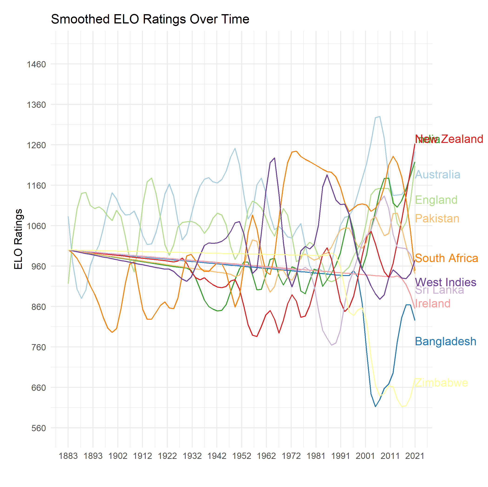

## Over Time ELO Rankings of International Cricket Teams By Format

The ICC only lists the [current ranking of cricket teams](https://www.icc-cricket.com/rankings/mens/team-rankings/odi). To address the paucity of historical ranking data, we generate ELO rankings.

### Data, Scripts, and Outputs

To build the [dataset of matches](data/cricket_matches.csv), we used the [python wrapper to espncricinfo](https://github.com/outside-edge/python-espncricinfo).

* [ELO Script](scripts/elo.R)

**Men's Test Team Ratings as of 6/18/2021**

**Smoothed Men's Test Team Ratings (1881--2021)**

Download the complete monthly ratings [here](data/test_ratings_1881_2021.csv)

**Smoothed Men's ODI Team Ratings (1972--2021)**

Download the complete monthly ratings [here](data/odi_ratings_1972_2021.csv)

**Smoothed Men's T20I Team Ratings (2006---2021)**

Download the complete monthly ratings [here](data/t20i_ratings_2006_2021.csv)

### Authors

Gaurav Sood and Derek Willis

