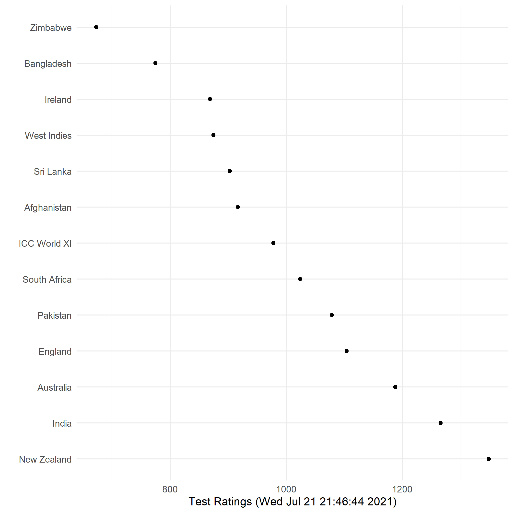
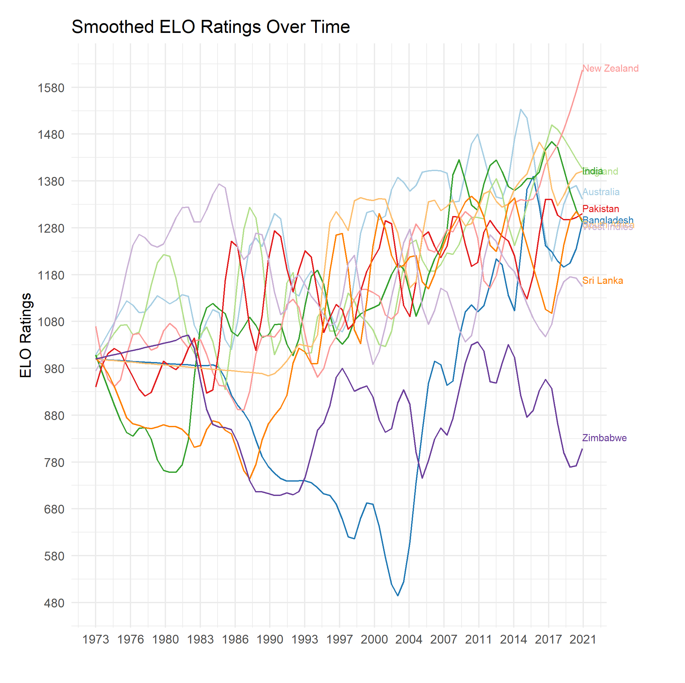

## Elo Ratings of International Cricket Teams By Format

The ICC only lists the [current ranking of cricket teams](https://www.icc-cricket.com/rankings/mens/team-rankings/odi). To address the paucity of historical ranking data, we generate monthly ELO ratings of all international cricket teams by format. We use

### Cricket Match Outcome Data

To construct [dataset of outcomes of cricket matches by date](data/cricket_matches.csv), we used the [python wrapper to espncricinfo](https://github.com/outside-edge/python-espncricinfo).

To generate the Elo ratings and graphs, we wrote the [following Script](scripts/elo.R)

### ELO Ratings Data

1. Monthly **men's test team** ratings (1881--2021) [here](data/test_ratings_1881_2021.csv)

2. Monthly **men's ODI team** ratings (1972--2021) [here](data/odi_ratings_1972_2021.csv)

3. Monthly **men's T20I team** ratings (2006---2021) [here](data/t20i_ratings_2006_2021.csv)

#### Figures

**Men's Test Team Ratings as of 6/18/2021**

**Smoothed Men's Test Team Ratings (1881--2021)**

**Smoothed Men's ODI Team Ratings (1972--2021)**

**Smoothed Men's T20I Team Ratings (2006---2021)**

### Authors

Gaurav Sood and Derek Willis

